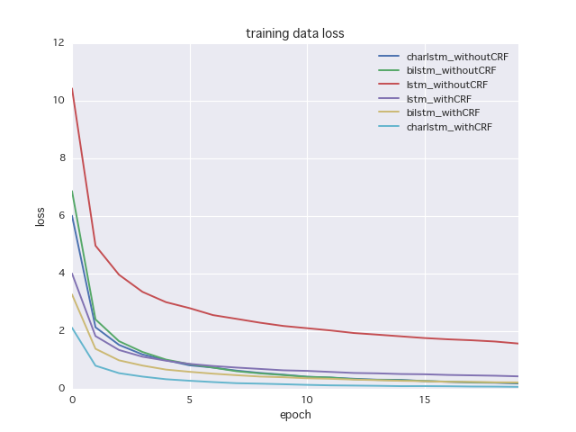
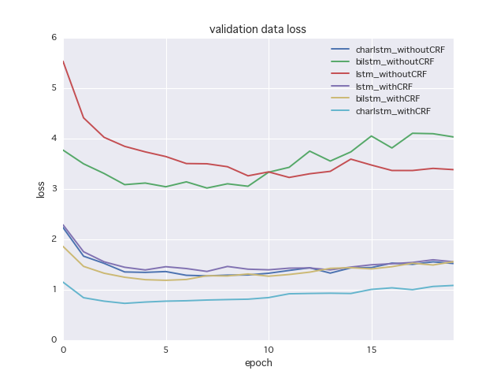
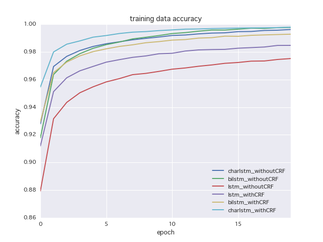

**Note:** This repository is part of the assignment given in Tohoku University - [Information Communication Theory (情報伝達学)](http://www.cl.ecei.tohoku.ac.jp/index.php?InformationCommunicationTheory) lecture.

Students were actually expected to do some feature engineering with [CRFsuite](http://www.chokkan.org/software/crfsuite/) but I personally preferred implementing RNN.

# About

This is the implementation of Named Entitty Recognition (NER) model based on Recurrent Neural Network (RNN). The model is heavily inspired by following papers:

* Chiu, Jason PC, and Eric Nichols. "Named entity recognition with bidirectional LSTM-CNNs." Transactions of the Association for Computational Linguistics 4 (2016): 357-370.
* James Hammerton. "Named Entity Recognition with Long Short-Term Memory." CONLL '03 Proceedings of the seventh conference on Natural language learning at HLT-NAACL 2003 - Volume 4
Pages 172-175
* Guillaume Lample, Miguel Ballesteros, Sandeep Subramanian, Kazuya Kawakami and Chris Dyer. "Neural Architectures for Named Entity Recognition." Proceedings of NAACL-HLT 2016, pages 260–270

Note that this repo is not re-implementation of these models.

The purpose of implementing models is to see how the performance improves when I change the model architecture from simple models to more complicated models, which are reported to perform well (e.g. LSTM --> Bidirectional LSTM --> Bidirectional LSTM with Character-Encoding)

I suppose that this model can be applied to other (sequential labeling) tasks, but I have not yet tried.

# Model Details
Following models are implemented by Chainer.

## Models with Cross Entropy as Loss Function
* LSTM (Model.py/NERTagger)
* Bi-directional LSTM (Model.py/BiNERTagger)
* Bi-directional LSTM with Character-based encoding (Model.py/BiCharNERTagger)

## Models with CRF Layer as Loss Function
This loss function is much better than simple cross entropy as it (latently) considers the restriction given to BIO tags.
* LSTM (CRFModel.py/CRFNERTagger)
* Bi-directional LSTM (CRFModel.py/CRFBiNERTagger)
* Bi-directional LSTM with Character-based encoding (CRFModel.py/CRFBiCharNERTagger)

# Requirements
## Software

* Python 3.*
* Chainer 1.19 (or higher)

## Resources

* Pretrained Word Vector (e.g. [GloVe](http://nlp.stanford.edu/projects/glove/))
    * The script will still work (and learn) without this, but the performance will significantly deteriorate. (Read papers for details)
* [CoNLL 2003 Dataset](http://www.cnts.ua.ac.be/conll2003/ner/)

# Usage
## Preprocessing
Place CoNLL datasets `train dev test` in `data/` and run `preprocess.sh`. This converts raw datasets into model-readable json format.

Then run `generate_vocab.py` and `generate_char_vocab.py` to generate vocabulary files.

## Training
* Training the model without CRF layer: `train_model.py`
* Training the model with CRF layer: `train_crf_model.py`

Both scripts have exact same options:
```
  usage: train_model.py [-h] [--batchsize BATCHSIZE] [--epoch EPOCH] [--gpu GPU]
                        [--out OUT] [--resume RESUME] [--test] [--unit UNIT]
                        [--glove GLOVE] [--dropout] --model-type MODEL_TYPE
                        [--final-layer FINAL_LAYER]

  optional arguments:
    -h, --help            show this help message and exit
    --batchsize BATCHSIZE, -b BATCHSIZE
                          Number of examples in each mini-batch
    --epoch EPOCH, -e EPOCH
                          Number of sweeps over the dataset to train
    --gpu GPU, -g GPU     GPU ID (negative value indicates CPU)
    --out OUT, -o OUT     Directory to output the result
    --resume RESUME, -r RESUME
                          Resume the training from snapshot
    --test                Use tiny datasets for quick tests
    --unit UNIT, -u UNIT  Number of LSTM units in each layer
    --glove GLOVE         path to glove vector
    --dropout             use dropout?
    --model-type MODEL_TYPE
                          bilstm / lstm / charlstm
    --final-layer FINAL_LAYER
                          loss function
```

## Testing
* Testing the model without CRF layer: `predict.py`
* Testing the model with CRF layer: `crf_predict.py`

Options:
```
optional arguments:
  -h, --help            show this help message and exit
  --unit UNIT, -u UNIT  Number of LSTM units in each layer
  --glove GLOVE         path to glove vector
  --model-type MODEL_TYPE
                        bilstm / lstm / charlstm
  --model MODEL         path to model file
  --dev                 If true, use validation data
```
Do not forget to specify `--model-type` and `model`.
(You need to give the path to trained model file)

The performance (Accuracy/Precision/F-Score) can be tested by `conlleval.pl` (not included in this repo.)

# Results
| Model        | CRF? | Precision | Recall | F-Score |
|--------------|------|-----------|--------|---------|
| LSTM         | No   | 70.87     | 65.38  | 68.01   |
| Bi-LSTM      | No   | 76.41     | 74.39  | 75.39   |
| Bi-Char-LSTM | No   | 84.93     | 81.65  | 83.26   |
| LSTM         | Yes  | 75.49     | 77.17  | 76.32   |
| Bi-LSTM      | Yes  | 79.71     | 81.49  | 80.59   |
| Bi-Char-LSTM | Yes  | 84.17     | 83.80  | 83.98   |

## Learning Curves

Epoch vs. training data loss



Epoch vs. Validation Data Loss



Epoch vs. Training Data Accuracy



Epoch vs. Validation Data Accuracy


